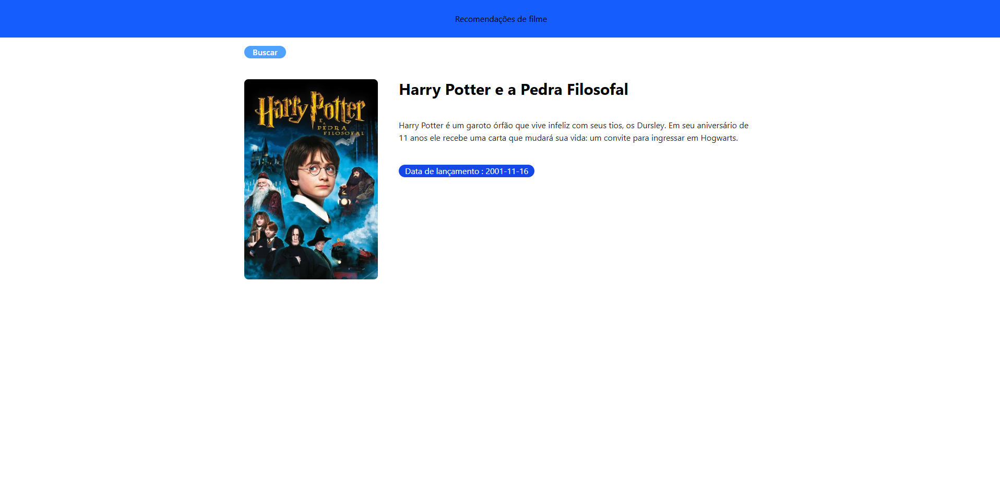

# 🏠 Movie App

## 👋 Seja bem-vindo

Este projeto foi desenvolvido para o treinamento de React e TypeScript.
É uma pagina de recomendaçoes de filmes aleatorios de uma API.

## 🛠️ Tecnologias utilizadas

- React.js
- TypeScript
- Tailwind Css
- API TMDB

## 💡 O que aprendi/fiz de novo

- Ultilização de TypeScript
- Estilização e responsividade com Tailwind CSS
- Consumir dados de uma API
